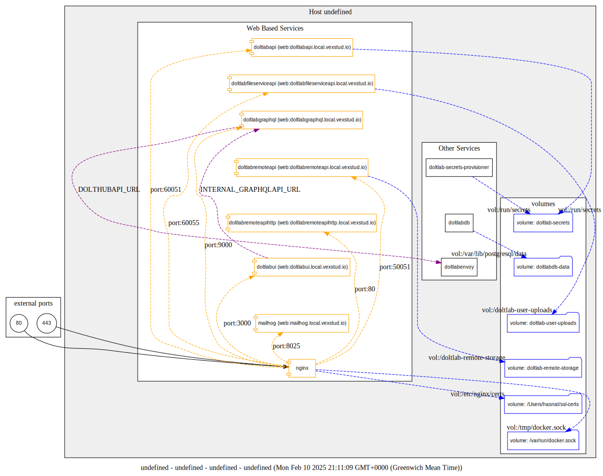

# Doltlab using docker-compose

Copy .env.example to .env

docker-compose -f docker-compose.yaml up

Visit http://doltlabui.local.vexstud.io/
register and login
verify account using http://mailhog.local.vexstud.io/

## playground (extras)
./doltplayground/README.md
